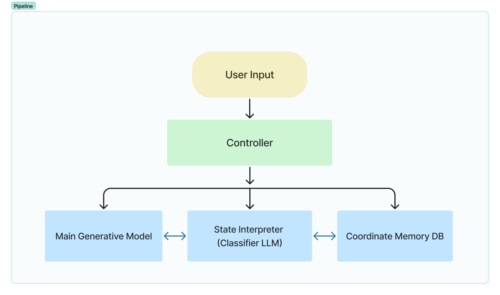
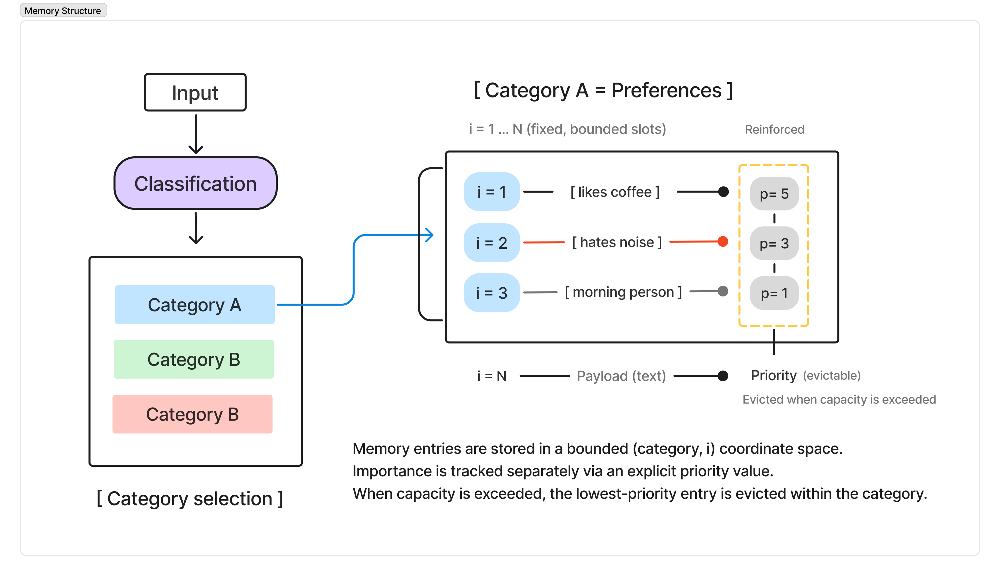
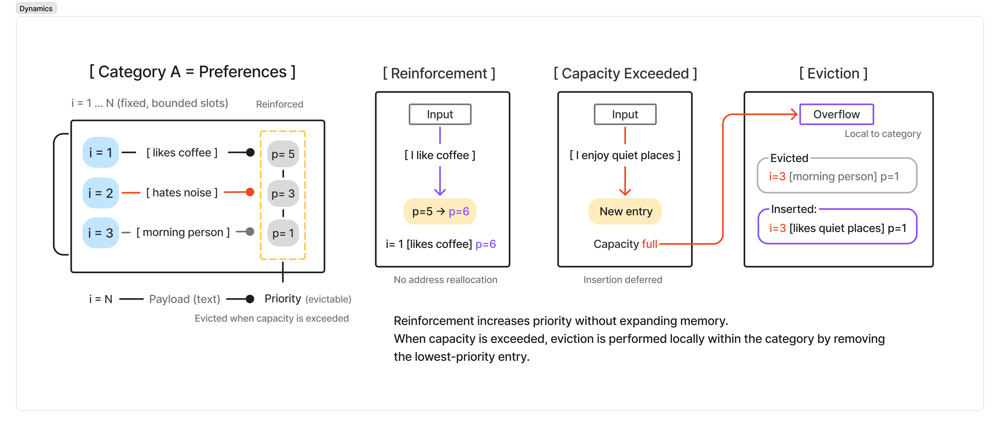

# Coordinate-Based Memory System (CMS) — Manuscript Abstract

Large language model (LLM) agents increasingly require persistent memory to support long-horizon interaction, user-specific adaptation, and stable behavior across dialogue sessions. Existing approaches typically rely on raw context accumulation, periodic summarization, or retrieval-augmented memory. While useful in practice, these approaches generally treat memory as prompt residue, compressed text, or a query-time retrieval target rather than as an explicitly managed state structure.

We introduce the Coordinate-Based Memory System (CMS), a policy-bounded and explicitly managed memory abstraction for persistent conversational agents. In CMS, memory is organized through a fixed scope-guided partition policy and updated by deterministic insertion, reinforcement, and exposure rules. The present work does not frame CMS as a full cognitive architecture or as a task-optimization method. Instead, it studies whether an explicit state-structured memory mechanism can be defined, implemented, and audited in a reproducible way under long-horizon conversational conditions.

CMS is evaluated against raw context accumulation, summarization-based memory, and retrieval-augmented generation as reference memory paradigms. These baselines anchor CMS against accumulation-, compression-, and similarity-based memory mechanisms. Evaluation focuses on systems-level memory properties, including retention fidelity, contradiction resistance, token footprint, observable update behavior, and bounded processing cost.

Under this framing, lower prompt burden, white-box auditability, selective eviction, and stable retention are treated not as independent headline claims, but as structural consequences of explicit state management. CMS is therefore presented as a minimal, implementation-aligned memory abstraction whose primary contribution lies in validating a distinct design point for persistent conversational memory.

## Status

This is a working manuscript abstract. Final experimental results, citations, and submission formatting are still being completed.

## Figures

### Figure 1. CMS within a modular conversational architecture

### Figure 2. Decoupled memory update and generation flow

### Figure 3. Bounded coordinate memory structure

### Figure 4. Priority reinforcement and local eviction dynamics

