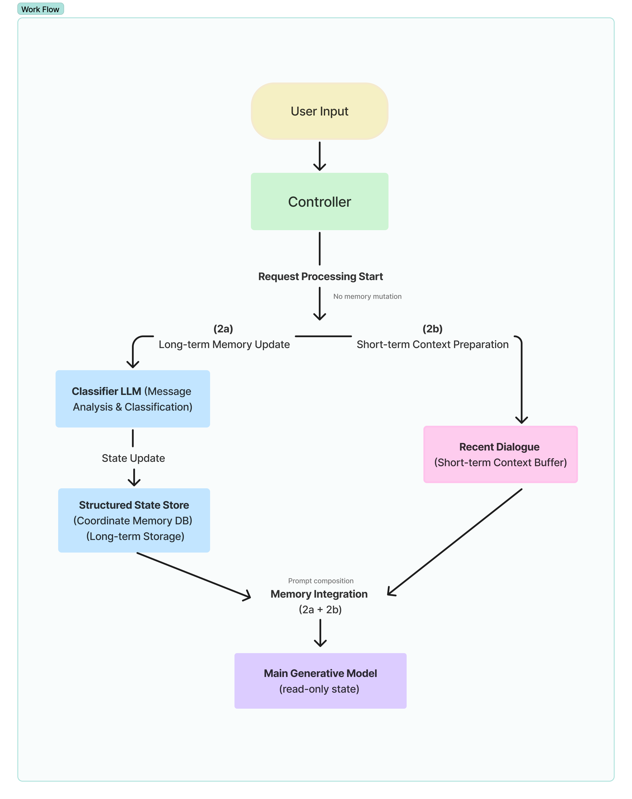

# Iris Hale

Independent AI researcher working on structured state architectures for AI agents, with a primary focus on long-term memory systems for LLM agents.

My current main project is the **Coordinate-Based Memory System (CMS)**, an explicit state-structured memory abstraction for persistent conversational agents.

This page serves as a public research profile for identity and research-activity verification.

## Contact

Email: irishale.art@gmail.com  
OpenReview registration email: irishale.art@gmail.com

## Affiliation

Independent Researcher.

I do not currently have a university affiliation, company affiliation, institutional email address, supervisor, coauthor, or institutional colleague who can verify my profile.

## Current Main Research

### Coordinate-Based Memory System (CMS)

I am developing and evaluating the **Coordinate-Based Memory System (CMS)**, a structured long-term memory abstraction for persistent conversational agents.

CMS treats conversational memory not as raw context accumulation, summarization, or retrieval output, but as an explicit state structure governed by fixed routing, update, priority, and exposure rules.

## CMS Overview Figure

The current CMS formulation separates long-term memory update from short-term context preparation and main generation.

The current CMS work focuses on:

- long-term memory for LLM agents
- persistent conversational memory
- explicit memory-state management
- coordinate-based memory representation
- deterministic memory update rules
- anchor-attribute memory units
- contradiction resistance
- token-footprint reduction
- white-box memory auditability

## Research Positioning

My work is related to:

- long-term memory systems for LLM agents
- AI agent memory
- persistent conversational agents
- structured memory systems
- retrieval-augmented generation
- cognitive architectures
- AI state modeling
- auditable and white-box AI systems

CMS is not proposed as a replacement for retrieval-augmented generation. Instead, it studies a complementary layer: how persistent memory can be represented, updated, prioritized, and exposed as an explicit state structure before downstream generation or retrieval.

## Current Manuscript

Working title:

**Coordinate-Based Memory System: An Explicit State-Structured Memory Abstraction for Persistent Conversational Agents**

Current status:

- working manuscript in preparation
- controlled long-horizon memory validation experiments in progress
- evaluation focuses on retention fidelity, contradiction resistance, token footprint, update traceability, and bounded processing behavior

## Broader Research Directions

In addition to CMS, I am developing broader structured-state approaches for AI agents and controllable generative systems.

### Mesh-Centric Cognitive Model (MCT)

MCT is a structured cognitive-state modeling framework based on nodes, edges, weights, and force-like propagation.

It is intended to model agent state, persona dynamics, affective tendencies, and behavior transitions as explicit and auditable state structures.

MCT is currently separate from the CMS manuscript, but it shares the same research direction: making internal AI state more structured, inspectable, and controllable.

### Expressive Audio Synthesis Engine (EASE)

EASE is a controllable expressive voice architecture built on structured state modeling.

It is not a standalone speech synthesis model. Rather, it is intended as a control and orchestration layer for expressive speech generation, voice acting support, prosody control, and auditability of generated voice performances.

EASE is currently a separate early-stage research direction and is not part of the current CMS submission.

## Current Verification Context

I am currently completing OpenReview profile activation as an independent researcher without institutional affiliation.

This page is provided to help verify my research identity, current work, and research activity.
